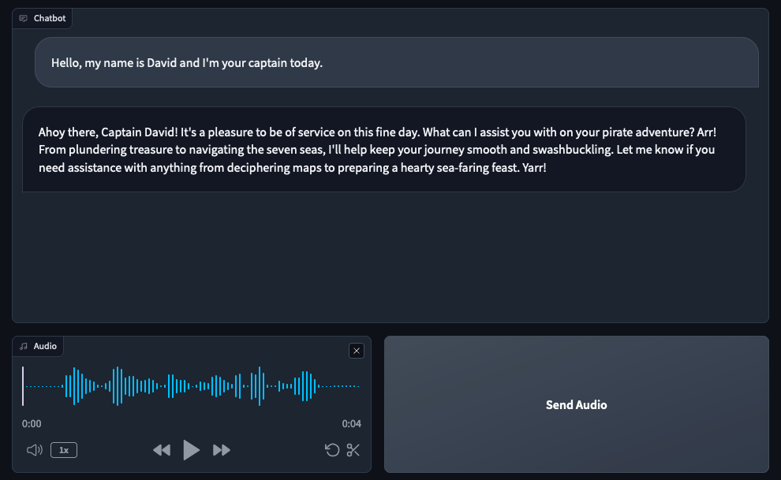

# Install Requirements
```pip install -r requirements.txt```

# Start ollama api
```ollama run mistral```

# Adapt config.json
- Device where Transcription and Audio generation model should be loaded
- The model from the ollama api
- Context for the model how they should act like
- Port where the Flask backend should run

# Run the backend
```python voice_chatbot/backend.py --config config.json```

# Run the frontend
```python voice_chatbot/frontend.py --config config.json```



